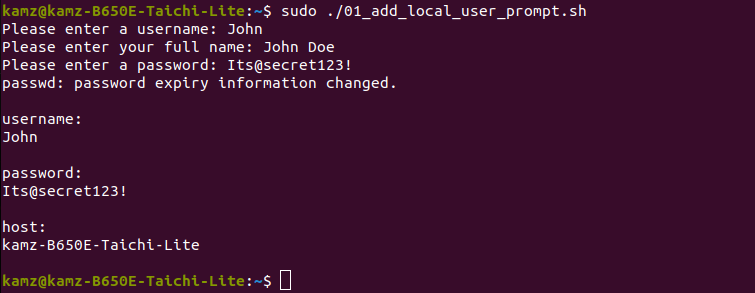

# Learning Journey into Bash Scripting

Welcome to my bash scripting journey! In this repository, I'm documenting my progress and sharing the scripts I've developed while learning bash scripting. Below, you'll find a brief overview of each script I've created. Additionally, you may find links to README.md files for scripts that require more detailed information.

### Linux Administration Scripts

#### User Management Scripts

---

- **01_add_local_user_prompt.sh**:

  This script allows for the creation of new local user accounts by prompting for a username, full name, and password, displaying the account details upon successful creation.

  

- **02_no_prompt_add_local_user.sh**:

  This script facilitates the creation of new local user accounts, where the user provides a username and comment as command-line arguments. It automatically generates a password for the account and displays the username, comment, password, and host upon successful creation.

  

- **03_generate_a_random_password.sh**:

  This script generates random passwords with customizable lengths and an option to include a special character. It also supports verbose mode for detailed output.

  

### Network Management Scripts

#### Network Monitoring and Automation (SSH into Large Network of Servers)

---

- **04_ping_servers.sh**:

  This script pings servers from a file, reporting their online/offline status. Requires pre-configured SSH key-based authentication.

  

### Log Analysis Scripts

---

- **05_potential_attackers.sh**:

  The script analyzes a log file (05_syslog_sample) for failed login attempts by IP address, identifying those with counts exceeding a predefined limit. It displays the count, IP, and location for each such occurrence.

  

- **06_top_three_urls.sh**:

  This script extracts URLs from a web server log file (06_visited_log), counts their occurrences, and displays the top three most visited URLs.

### Personal Use Scripts

#### Simple scripts of commands I tend to use often

---

- **07_update_system.sh**:

  This script ensures it is run with root privileges, then updates and upgrades all packages. It removes unnecessary packages and cleans the package cache, providing success or failure messages for each step, and ends with a completion message.

  

- **08_check_partitions.sh**:

  Organizes and displays partitions, ordering them by size from largest to smallest. Removes boot/MBR partitions and shows only actual SSDs/NVMe drives and any inserted removable USB drives/storage, allowing me to differentiate between Ubuntu and Windows 11 HDDs in my dual-boot system.

  

Feel free to explore the scripts, provide feedback, or contribute to their improvement. Happy scripting!
